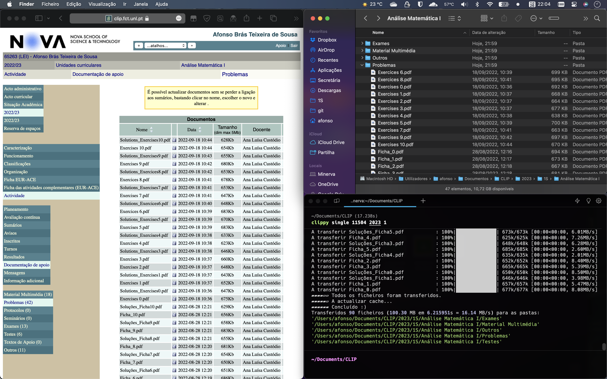
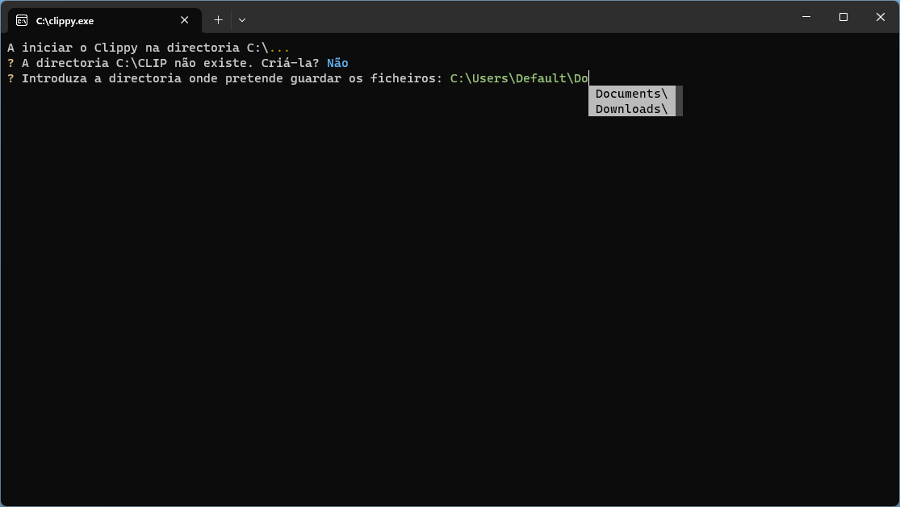
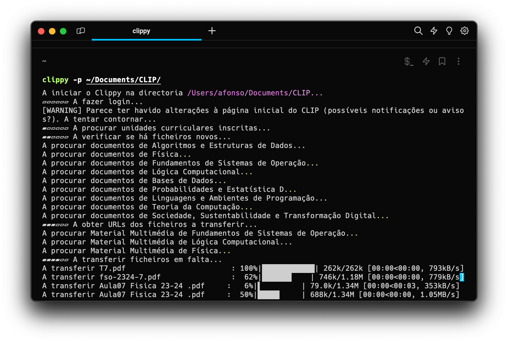

<div align="center">


# Clippy

## Um gestor de downloads para a plataforma CLIP da FCT-NOVA (BETA)

  

por Afonso Brás Sousa

[](https://github.com/abtsousa/clippy/stargazers) [](https://github.com/abtsousa/clippy/blob/master/LICENSE)

</div>

### 🇬🇧 [English version here / Clica aqui para ler a descrição em Inglês](README.md) 🇬🇧

O Clippy é um simples web scraper e gestor de downloads para a plataforma interna de e-learning da FCT-NOVA, o CLIP.

O programa navega o CLIP à procura de ficheiros nas páginas das cadeiras de um utilizador e sincroniza-os com uma pasta local.

O CLIP está organizado em subcategorias para cada cadeira assim:
Ano >> Documentos da cadeira >> Subcategoria >> Ficheiros

O Clippy navega o site e compara os ficheiros disponíveis com uma pasta local, sincronizando-a com o servidor.

## Funcionalidades

- Multiplataforma (testado em MacOS, Arch Linux e Windows)
- Extremamente rápido graças à sua execução assíncrona (permite verificar até 8 cadeiras ao mesmo tempo).
- Transfere múltiplos ficheiros (até 4 ficheiros em simultâneo).
- Sincronização automática de ficheiros entre o CLIP e a pasta do utilizador.
- Suporte para escolher qual o ano lectivo que pretende descarregar.
- Totalmente privado, gratuito e livre.

## Screenshots

  
## Como instalar

**NOTA:** O programa está em beta. [Deixa uma estrela](https://github.com/abtsousa/clippy/stargazers) para apoiares o projecto e seres notificado de actualizações.

É necessário instalar o [Python](https://www.python.org/downloads/) ≥ v3.8 para instalar de raíz.

**Recomendado (Windows/Mac/Linux):** Compila e instala de raíz com o comando pip:

```pip install https://github.com/abtsousa/clippy/archive/stable.zip```

**Alternativa (Windows só):** Transfere o ficheiro clippy.exe da [página da versão mais recente](https://github.com/abtsousa/clippy/releases/latest) e cola-o na pasta onde queres que o Clippy guarde os ficheiros, depois corre o programa.

**Se encontrares *bugs* envia-os por aqui ou para o email académico `ab.sousa@campus.fct[...etc]`**. Usa a opção `--debug` para gerar um ficheiro debug.log que deves anexar ao email.

## Como usar

Na consola: `clippy [OPÇÕES] COMANDO [ARGUMENTOS]`

Manual / ajuda: `clippy --help` | `clippy batch --help` | `clippy single --help`

Existem dois modos principais (comandos): `batch` ou série (padrão) e `single` ou único

### Modo Batch (padrão)

Faz o download de todos os ficheiros disponíveis para todas as cadeiras do utilizador durante o ano.

#### Exemplos

- `clippy` Guarda os ficheiros numa subpasta CLIP no caminho actual.
- `clippy --relogin --path C:\CLIP` Ignora as credenciais guardadas e guarda os ficheiros na pasta C:\CLIP.
- `clippy --no-auto -p ~/CLIP` Deixa o utilizador escolher o ano que quer descarregar e guarda os ficheiros na pasta ~/CLIP.

#### Opções

Todas as opções são, por definição, opcionais.

```text
--username    -u  O nome de utilizador no CLIP.
--path        -p  A pasta onde os ficheiros do CLIP serão guardados. Se estiver em branco usa a directoria actual.
--year        -y  O ano lectivo para descarregar.
--auto            Escolhe automaticamente o ano lectivo mais recente. (activado por padrão)
--relogin         Ignora as credenciais de login guardadas. (desactivado por padrão)
--version         Mostra a versão do programa.
--help            Mostra esta mensagem e sai.
```

### (NOVO) Modo Single

Faz o download de todos os ficheiros disponíveis para uma única cadeira especificada.

O utilizador não precisa de estar inscrito na cadeira. Isso é especialmente útil para descarregar ficheiros de outra cadeira ou de um ano / semestre diferente do qual o utilizador está inscrito.

#### Exemplo

Se me inscrevi em **Análise Matemática I** (ID **11504** no CLIP) em 2023/2024, mas desejo aceder aos slides e exames do ano lectivo anterior (2022/**2023**), no **primeiro** semestre, basta escrever:

`clippy single 11504 2023 1`

O programa agora fará o download de todos os ficheiros para a cadeira desse semestre.

#### Opções

Todas as opções são, por definição, opcionais.

```text
--username    -u  O nome de utilizador no CLIP.
--path        -p  A pasta onde os ficheiros do CLIP serão guardados. Se estiver em branco usa a directoria actual.
--is-trimester -t A cadeira é trimestral.
--is-semester -s  A cadeira é semestral (padrão)
--relogin         Ignora as credenciais de login guardadas. (desactivado por padrão)
--help            Mostra esta mensagem e sai.
```

## Privacidade

As credenciais fornecidas são transmitidas apenas aos servidores do CLIP e podem opcionalmente ser guardadas no sistema local para facilitar o acesso futuro. O programa não estabelece ligação com servidores terceiros.

O autor do programa não obtém qualquer informação relativa ao utilizador ou a forma como usa o programa, nem mesmo para telemetria.

Este programa é fornecido "tal como está" e destina-se estritamente ao uso privado, limitado às suas funcionalidades de transferência de arquivos. Ao utilizar este programa, o utilizador concorda em isentar o autor de qualquer responsabilidade por danos ou consequências decorrentes de uso inadequado, incluindo, mas não se limitando a, bugs, erros de servidor ou uso indevido de funcionalidades não previstas inicialmente.

## Licença e Copyright

Clippy foi criado em 2023 por Afonso Brás Sousa, um estudante de Eng. Informática do 1º ano da FCT da Universidade NOVA de Lisboa.

Licenciado sob a GPL v3.

CLIP (c) 2023 FCT NOVA - Faculdade de Ciências e Tecnologia, 2829-516 Caparica, Portugal
